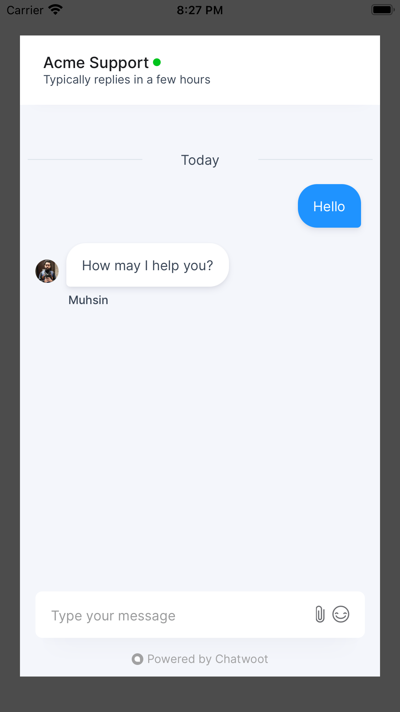

<h1>
chatwoot-react-native-widget (Work in progress)
</h1>


[](http://makeapullrequest.com)


- **Supported Chatwoot version:** 1.13.2+




### Installation

Install the library using either yarn or npm like so:

```sh
yarn add chatwoot-react-native-widget
```

OR

```sh
npm install --save chatwoot-react-native-widget
```

This library depends on [react-native-webview](https://www.npmjs.com/package/react-native-webview) and [async-storage](https://github.com/react-native-async-storage/async-storage). Please follow the instructions provided in the docs.

### iOS Installation

If you're using React Native versions > 60.0, it's relatively straightforward.

```sh
cd ios && pod install
```

### How to use

1. Create a website channel in chatwoot server by following the steps described here https://www.chatwoot.com/docs/channels/website
2. Replace `websiteToken` prop

```

import React, { useState } from 'react';

import { StyleSheet, View, SafeAreaView, TouchableOpacity, Text } from 'react-native';

import ChatWootWidget from 'chatwoot-react-native-widget';

const App = () => {
  const [showWidget, toggleWidget] = useState(false);
  const user = {
    identifier: 'john@gmail.com',
    name: 'John Samuel',
    avatar_url: '',
    email: 'john@gmail.com',
    identifier_hash: '',
  };
  const customAttributes = { accountId: 1, pricingPlan: 'paid', status: 'active' };
  const websiteToken = 'WEBSITE_TOKEN';
  const baseUrl = 'CHATWOOT_INSTALLATION_URL';
  const locale = 'en';

  return (
    <SafeAreaView style={styles.container}>
      <View>
        <TouchableOpacity style={styles.button} onPress={() => toggleWidget(true)}>
          <Text style={styles.buttonText}>Open widget</Text>
        </TouchableOpacity>
      </View>
      <ChatWootWidget
          websiteToken={websiteToken}
          locale={locale}
          baseUrl={baseUrl}
          closeModal={() => toggleWidget(false)}
          isModalVisible={showWidget}
          user={user}
          customAttributes={customAttributes}
        />
    </SafeAreaView>
  );
};

const styles = StyleSheet.create({
  container: {
    flex: 1,
    justifyContent: 'center',
    alignItems: 'center',
  },

  button: {
    height: 48,
    marginTop: 32,
    paddingTop: 8,
    paddingBottom: 8,
    backgroundColor: '#1F93FF',
    borderRadius: 8,
    borderWidth: 1,
    borderColor: '#fff',
    justifyContent: 'center',
  },
  buttonText: {
    color: '#fff',
    textAlign: 'center',
    paddingLeft: 10,
    fontWeight: '600',
    fontSize: 16,
    paddingRight: 10,
  },
});

export default App;

```

### Props

<table class="table">
<thead><tr>
  <th>Name</th><th>Default</th><th>Type</th><th>Description</th>
</tr></thead>
<tbody>
  <tr>
    <td>websiteToken</td>
    <td> - </td>
    <td> String </td>
    <td>The website token copyied from website channel</td>
  </tr>
  <tr>
    <td>baseUrl</td>
    <td> - </td>
    <td> String </td>
    <td>Chatwoot installation url</td>
  </tr>
  <tr>
	  <td>user</td>
    <td> {} </td>
    <td> Object </td>
    <td>User information about the user like email, username and avatar_url</td>
  </tr>
  <tr>
   <td>customattributes</td>
    <td> {} </td>
    <td> Object </td>
    <td>Additional information about the customer</td>
  </tr>
 </tbody>
</table>

## Feedback & Contributing

Feel free to send us feedback on [Twitter](https://twitter.com/chatwootapp) or [file an issue](https://github.com/chatwoot/chatwoot-mobile-app/issues).

If there's anything you'd like to chat about, please feel free to join our [Discord](https://discord.gg/cJXdrwS) chat!

_Chatwoot_ &copy; 2017-2020, Chatwoot Inc - Released under the MIT License.
